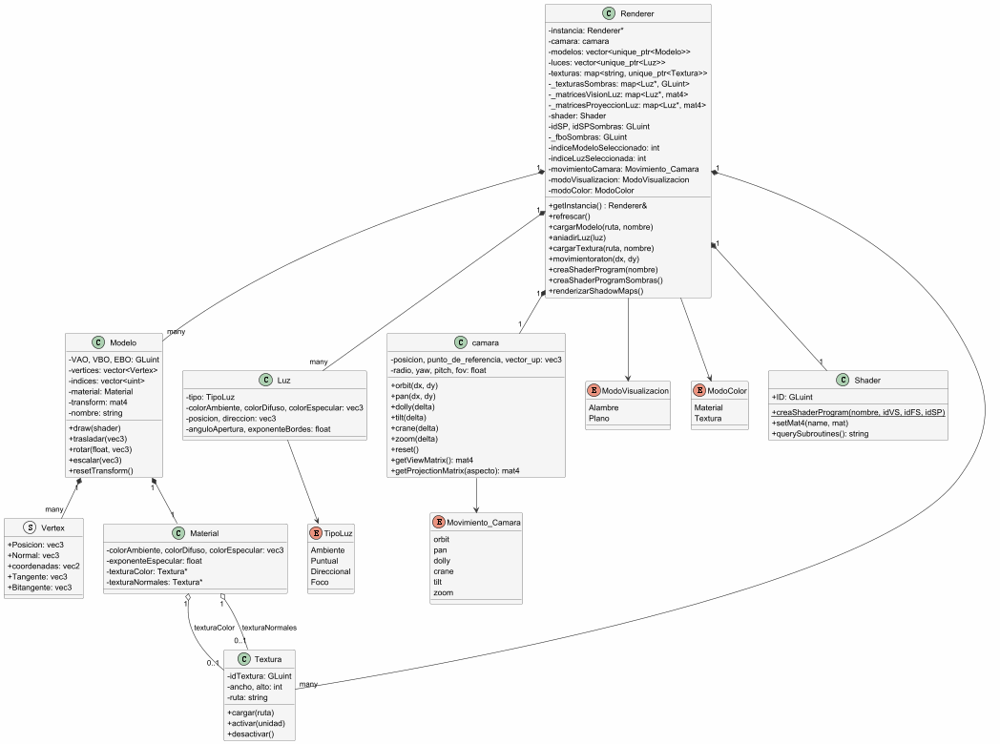

# Práctica PAG

>**Autor:** Jaime Delgado Altés

>**Asignatura:** Programación de Aplicaciones Gráficas

>**Curso:** 2025/2026

-------

## Descripción del Proyecto

Este proyecto consiste en un visualizador 3D desarrollado en C++.

Todo el tema de la interfaz gráfica usa ImGui y la clase Renderer se encarga de enlazar las clases.

## Características implementadas

- Cargar modelos usando la biblioteca Assimp.
- Aplicar transformaciones de modelado(traslación, rotación, escalado).
- Gestionar movimientos de cámara.
- Gestionar materiales con propiedades ambiente, difusa, expeculary exponente.
- Soportar múltiples tipos de luces (ambiente, puntual, direccional, focal).
- Aplicar texturas 2D y normal mapping.
- Gestionar sombras proyectadas mediante shadow mapping.
- Dos subrutinas GLSL independientes.

-------

## Manual de usuario

### Ventanas ImGui

La aplicación abre 7 ventanas flotantes:

1. **Mensajes**: log de eventos.
2. **Fondo**: selector de color para el fondo de la escena.
3. **Shader Program**: caja de texto + botón "Load" para cargar shaders.
4. **Cámara**: selector del tipo de movimiento (orbit/ pan/ dolly/ crane/ tilt/ zoom) + botón de reset.
5. **Modelos**: cargar/eliminar modelos, seleccionar uno y aplicar transformaciones (traslación, rotación por eje, escalado) + editar material (ka, kd, ks, shininess) + modo de visualización (alambre/ plano).
6. **Luces**: añadir luces de los 4 tipos, editar colores, posición y ángulo de apertura del foco.
7. **Texturas**: cargar textura de color, cargar mapa de normales, activar/desactivar normal mapping y sombras proyectadas, y cambiar entre modo Material / Textura.

### Orden recomendado de uso

1. Cargar al menos un modelo desde la ventana **Modelos**.
2. Añadir una o varias luces desde la ventana **Luces**.
3. Asignar textura de color desde la ventana **Textura**.
4. Opcionalmente, cargar un mapa de normales y activar el checkbox "Activar Normal Mapping".
5. Activar "Activar sombras proyectadas" para ver el shadow mapping.

--------

## Práctica 2

### Decisiones de diseño
- **Patron Singleton** en `Pag::Renderer`:
  - Contructor privado + atributo estático `instancia`.
  - Inicializacion perezosa en `getInstancia`:
    ```cpp
    Renderer& Renderrer::getInstancia(){
        if(!instancia) instancia = new Renderer;
        return *instancia;
    }
  
  - Garantiza una única instancia accesible desde los callbacks de GLFW.
  - Desacoplamiento GLFW ↔ OpenGL: el main solamente llama a métodos de `Renderer`, no hace llamadas directas a OpenGL.
  - Ventana de mensajes con `std::deque<std::string>`.
  - Uso de ImGui para el apartado de la interfaz gráfica.

-------------

## Práctica 3

### Decisiones de diseño

  - Shader mínimos: (`pag-vs.glsl` y `pag03-fs.glsl`).
  - Carga de shaders desde ficheros externos: con un nombre común como parámetro (`pag03`).

-------------

## Práctica 4

### Decisiones de diseño

  - Clase `Shader` con método estático `creashaderProgram(nombre, idVS, idFS, idSP)` que encapsula:
    - Carga del código GLSL desde ficheros (`../Shaders/{nombre}-vs.glsl` y `../Shaders/{nombre}-fs.glsl`).
    - Compilación y enlazado con comprabación de errores.
    - Gestión de uniforms.
  - Ventana ImGui "Shader Program" con caja de texto + botón "Load" para recargar shaders.

-------------

## Práctica 5

### Decisiones de diseño

  - Clase `PAG::camara` que contiene todo lo necesario para controlar el movimiento de una cámara.
  - 6 movimientos implementados:
    - `orbit` : rotación en latitud/longitud.
    - `pan` : rotación horizontal alrededor del eje `v` local.
    - `dolly` : traslación en el plano XZ.
    - `tilt` : rotación vertical alrededor del eje `u` local.
    - `crane` : traslación en el eje Y global.
    - `zoom` : cambio de FOV.
  - Selector de movimiento de la cámara.
  - El movimiento de la cámara se hace mediante el ratón.

-------------

## Práctica 6

### Decisiones de diseño

  - Clase `PAG::Modelo` que almacena:
    - VAO, VBO, EBO.
    - Vector de `Vertex` (con posición , normal, textCoord, tangente, bitangente).
    - Vector de índices.
    - Matriz de modelado propia (`glm::mat4`).
    - Nombre del modelo.
  - Carga con Assimp usando los flags:
    ```cpp
    aiProcess_Triangulate | aiProcess_GenNormals | aiProcess_CalcTangentSpace | aiProcess_JoinIdenticalVertices
  - Un único VAO por modelo


-------------

## Práctica 7

### Decisiones de diseño

  - Clase `PAG::Material` con atributos `colorAmbiente`, `colorDifuso`, `colorEspecular` (`glm::vec3`) y `exponenteEspecular` (`float`). Cada `Modelo` tiene un `Material` asociado.
  - Modo Visualización mediante `glPolygonMode` + uniform `uModoVisualizacion`:
    - `0` alambre (color fijo en el fragment shader).
    - `1` plano (color del material/textura iluminado).
  - Ventana ImGui para editar los parámetros del material del modelo seleccionado.

-------------

## Práctica 8

### Decisiones de diseño

  - Clase `PAG::Luz` con `enum class TipoLuz {Ambiente, Puntual, Direccional, Foco}`.
  - Subrutina `fCalcularIluminación` con 4 implementaciones en el fragment shader: `luzAmbiente`, `luzPuntual`, `luzDireccional`, `luzFoco`.
  - Luz ambiente precargada al inicio de la aplicación junto con una puntual, una direccional y un foco, para que la escena se vea iluminada desde el primer momento.
  - Rendering multipasada con blending acumulativo, primero la primera luz y luego se añaden las demás.

-------------

## Práctica 9

### Decisiones de diseño

  - Carga con LodePNG (archivos `lodepng.h` y `lodepng.cpp` integrados).
  - Volteado de la imangen (LodePNG carga con la Y invertida respecto a OpenGL).
  - Texturas gestionadas por `Renderer`.
  - Segunda subrutina `fObtenerColorBase` con implementaciones `colorDeMaterial()` y `colorDeTextura()`.

-------------

## Práctica 10

### Decisiones de diseño

  - Mapa de normales cargado como segunda textura del material (`texturaNormales`).
  - Tangentes y bitangentes obtenidas con Assimp añadiendo el flag `aiProcess_CalcTangentSpace` y añadidas al VAO en `location = 3` y `location = 4`.
  - Shader de sombras (`shadow-vs.glsl` + `shadow-fs.glsl` vacío).

-------------


## Diagrama de clases UML

